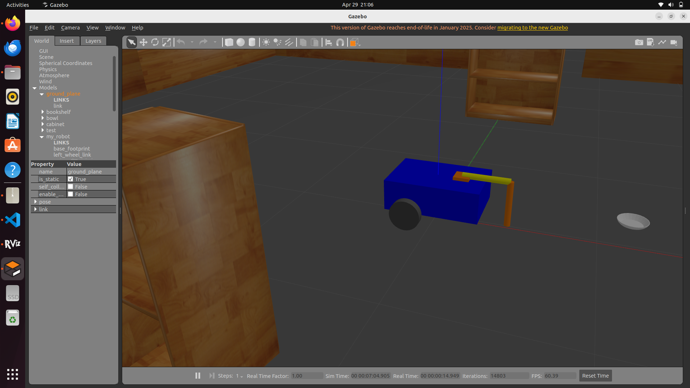
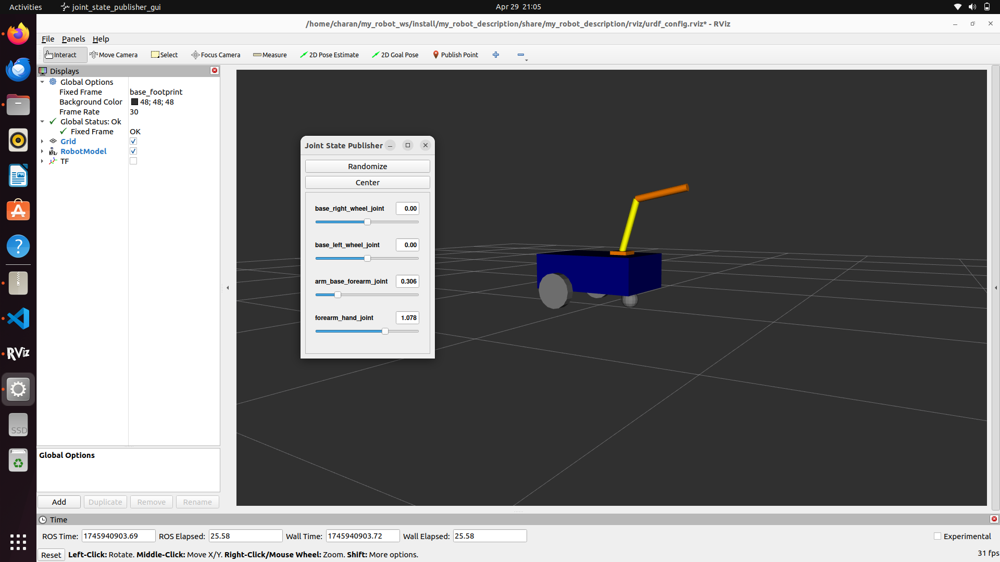
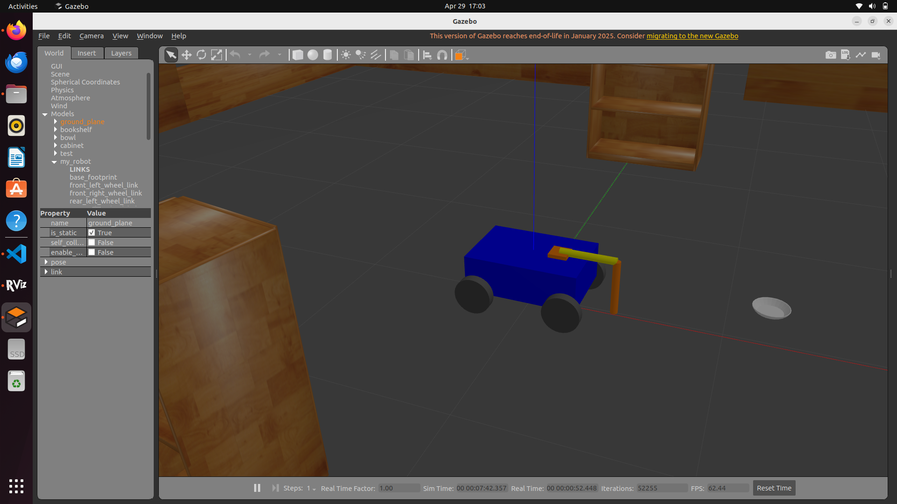
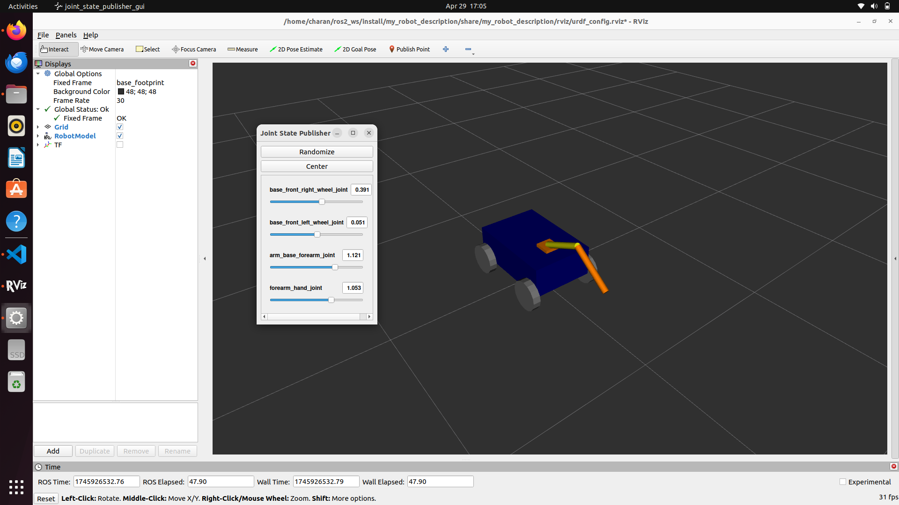
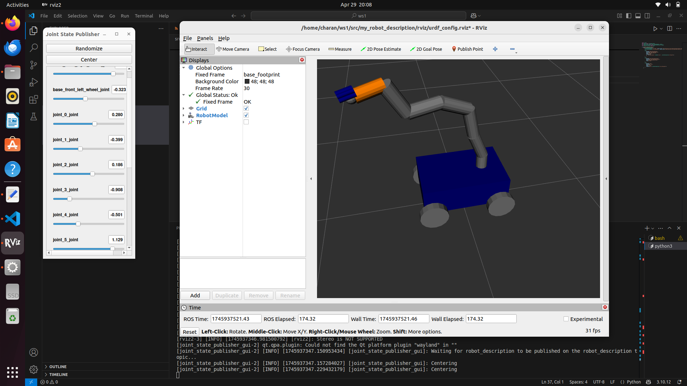
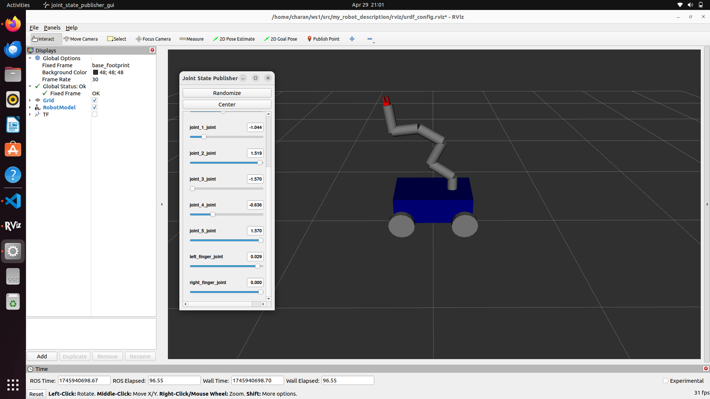
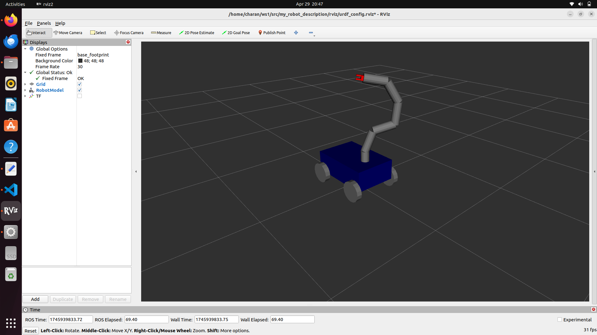

# 🤖 Simulated 4-Wheeled Mobile Robot with 6-DOF Arm

## 📝 Project Description

This project simulates a mobile robot featuring a 4-wheeled base and a 6-DOF robotic arm using ROS and Gazebo.

## 👥 Team Members

- **C.CHARAN**  
- **K.RAMU**  
- **K.VENKATESH**

## 💻 System Configuration

This simulation was developed and tested on the following system:

- **Operating System**: Ubuntu 22.04 LTS  
- **ROS 2 Distribution**: Humble Hawksbill  
- **Simulator**: Gazebo  
---
 
## 🛠️ Tech Stack & Tools Used

This project uses the following technologies and tools for simulating and visualizing the mobile robot with a 6-DOF arm:

- **ROS 2 (Robot Operating System)** – Middleware for robot software development
- **Gazebo** – 3D robotics simulator for testing robot behavior in virtual environments
- **RViz** – Visualization tool for robot state, TFs, and sensor data
- **URDF / Xacro** – For defining the robot's physical structure and joint configurations
- **Python** – Used in ROS 2 launch files and scripts (e.g., `arm_gazebo.launch.py`)
- **XML** – Used in older-style launch files and robot descriptions (e.g., `display.launch.xml`)
- **YAML** – Configuration files (e.g., `arm_controllers.yaml`) for controllers and plugins
- **CMake / package.xml** – Standard ROS 2 package configuration and build system

### 🗂️ Key Packages

- `my_robot_description/` – Contains URDF/Xacro files, robot structure, sensors, and configurations
- `my_robot_bringup/` – Launch files for starting the simulation, RViz, and Gazebo
- `worlds/` – Custom simulation world (e.g., `test_world.world`)
- `rviz/` – RViz visualization configuration

# Two-Wheeled Robot with Jointed Arm

## Project Overview

We started this project with a two-wheeled robot design, incorporating one caster wheel for stability. The robot is equipped with a two-jointed arm to enable basic manipulation tasks. Our goal is to create a functional robot capable of autonomous movement and object interaction. The project serves as a foundation for further exploration and enhancements in robotics.
## Usage
## 1. Launch the Robot in Gazebo
### To start the robot simulation in Gazebo, use the following launch command:
```bash
ros2 launch my_robot_bringup my_robot_gazebo.launch.xml
```


## 2. Launch the Robot Description in RViz
### To visualize the robot model in RViz, use the following command:

```bash
ros2 launch my_robot_description display.launch.py
```


## 3. Control the Movement of the 4-Wheeled Robot
### To control the robot's movement using keyboard teleoperation, run the following command:

```bash
ros2 run teleop_twist_keyboard teleop_twist_keyboard --ros-args -r /cmd_vel:=/cmd_vel
```
## 4. Test the Arm Movement
### To test the arm's movement, publish a joint trajectory using the following command:

```bash
ros2 topic pub -1 /set_joint_trajectory trajectory_msgs/msg/JointTrajectory '{header: {frame_id: "base_footprint"}, joint_names: ["arm_base_forearm_joint", "forearm_hand_joint"], points: [{positions: [0.1, 0.4]}]}'
```
# Enhancement 1

After the initial design of the two-wheeled robot, the project was enhanced to include a four-wheeled robot for improved stability and control. Additionally, a two-jointed arm was integrated to provide more advanced manipulation capabilities. This enhancement allows the robot to perform more complex tasks and navigate more effectively. The upgraded design offers a more versatile platform for various robotic applications.

## Usage
## 1. Launch the Robot in Gazebo
### To start the robot simulation in Gazebo, use the following launch command:
```bash
ros2 launch my_robot_bringup my_robot_gazebo.launch.xml
```


## 2. Launch the Robot Description in RViz
### To visualize the robot model in RViz, use the following command:

```bash
ros2 launch my_robot_description display.launch.py
```


## 3. Control the Movement of the 4-Wheeled Robot
### To control the robot's movement using keyboard teleoperation, run the following command:

```bash
ros2 run teleop_twist_keyboard teleop_twist_keyboard --ros-args -r /cmd_vel:=/cmd_vel
```
## 4. Test the Arm Movement
### To test the arm's movement, publish a joint trajectory using the following command:

```bash
ros2 topic pub -1 /set_joint_trajectory trajectory_msgs/msg/JointTrajectory '{header: {frame_id: "base_footprint"}, joint_names: ["arm_base_forearm_joint", "forearm_hand_joint"], points: [{positions: [0.1, 0.4]}]}'
```

# Enhancement 2

The project was further enhanced by upgrading to a four-wheeled robot with a 6-DOF arm, providing greater mobility and flexibility. A 5-finger mechanical gripper was added to the arm, enabling more precise object handling and manipulation. This enhancement allows the robot to perform more complex tasks with a higher degree of dexterity. The 6-DOF arm with the 5-finger gripper enhances the robot’s ability to interact with its environment in a more sophisticated manner.

##  Launch the Robot Description in RViz
### To visualize the robot model in RViz, use the following command:

```bash
ros2 launch my_robot_description display.launch.py
```


# Enhancement 3

Building on the previous enhancement, the two-jointed arm was further upgraded to a 6-DOF arm, offering greater flexibility and precision. A mechanical gripper was also added to enable more complex manipulation tasks, such as picking and placing objects. This upgrade significantly expands the robot's capabilities in performing various operations. The 6-DOF arm with a gripper provides enhanced dexterity for handling a wide range of objects.

##  Launch the Robot Description in RViz
### To visualize the robot model in RViz, use the following command:

```bash
ros2 launch my_robot_description display.launch.py
```







### How to setup this project in local environment
1. **Create a workspace**: The first step is to create a ROS 2 workspace (`~/ros2_ws/src`) and navigate to it.
2. **Clone the project**: Clone the repository from GitHub into the `src` folder.
3. **Build the workspace**: Use `colcon build` to build all the packages in the workspace.
4. **Source the setup file**: This step ensures that ROS 2 knows about the packages you just built.
5. **Launch commands**: Instructions to launch the robot simulation in Gazebo and visualize it in RViz.

# Robot Control and Simulation

## Setup

## 1. Create a ROS 2 Workspace

### First, create a new ROS 2 workspace by following these steps:

```bash
# Create a directory for your ROS 2 workspace
mkdir -p ~/ros2_ws/src
cd ~/ros2_ws/src
```
## 2. Clone the Project Repository
### Next, clone the project from GitHub into the src folder of your workspace:

```bash
# Clone the repository
git clone https://github.com/Charancholaveti/ROS_PROJECT.git
```
## 3. Build the Workspace
### Once the repository is cloned, navigate back to the workspace directory and build the workspace using colcon:

```bash
cd ~/ros2_ws
colcon build
```
## 4. Source the Workspace
### After building the workspace, source the setup file to make the packages available for use:

```bash
source install/setup.bash
```
## 5. Launch the Robot in Gazebo
### To start the robot simulation in Gazebo, use the following launch command:
```bash
ros2 launch my_robot_bringup my_robot_gazebo.launch.xml
```

## 6. Launch the Robot Description in RViz
To visualize the robot model in RViz, use the following command:

```bash
ros2 launch my_robot_description display.launch.py
```


